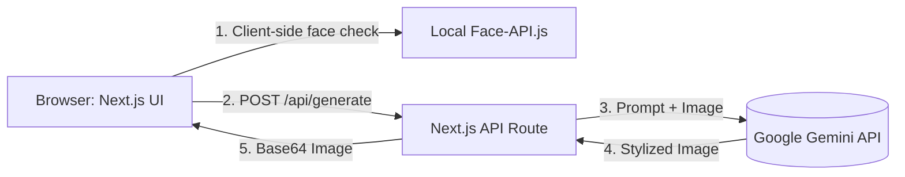

# AI Avatar Generator — Engineering Design Doc

**Author:** Antigravity (Eng)
**Status:** Draft v0.1
**Last updated:** 2026-07-08
**Reviewers:** TBD

---

## 1. Summary

We are building a single-screen AI Avatar Generator that allows users to upload a photo with a visible face, select a preset style, and receive a stylized avatar. The system will be built as a single monolithic **Next.js** application. The frontend handles image upload, client-side face detection, and the core "magical" loading animations. The Next.js API routes will securely communicate with the Google Gemini API to generate the stylized image and return it to the client.

## 2. Assumptions

- **Target scale:** <1k DAU in v1. 
- **Latency budget:** The Gemini image generation will take time. We are budgeting ~3-6s for the API call. The UI's "scanning laser" animation must mask this latency seamlessly.
- **Platform:** Mobile-responsive web app (Next.js).
- **Cost ceiling:** Gemini API costs per image generated.
- **Out of scope:** User accounts, image history, bulk generation, complex prompt customization.

## 3. Goals & non-goals

**Goals (v1):**
- Client-side validation to ensure a face is present *before* consuming backend resources.
- Securely proxy requests to the Gemini API without exposing the API key to the client.
- Deliver the final image to the client with <6s p95 latency.

**Non-goals (v1):**
- Server-side database or cloud storage. (The generated image is returned as a base64 string or ephemeral URL, and the user downloads it directly; we don't store it).
- Authentication, rate limiting beyond basic Vercel/Next.js defaults, or user sessions.

## 4. Architecture



**What's here:**
- Next.js Frontend — Handles the upload, face detection, and animations.
- Next.js API Route — Acts as a secure proxy to construct the prompt and call Gemini.
- Local Face Detection — A lightweight library (e.g., `face-api.js` or MediaPipe) running in the browser.

**What's deliberately NOT here:**
- No database — We don't store the user's uploaded photo or the generated avatar.
- No cloud storage bucket (S3/GCS) — Images are processed in memory and passed back as base64 to avoid storage costs and privacy liabilities.
- No background workers/queues (Celery/Redis) — We rely on the synchronous API route and client-side HTTP timeouts, keeping infrastructure boring and simple.

## 5. Key components

### Client-Side Face Detector
- **Responsibility:** Ensure the uploaded image contains at least one face.
- **Tech choice:** `@mediapipe/tasks-vision` or a lightweight `face-api.js` model.
- **Why this choice:** Prevents sending invalid images to Gemini, saving API costs and providing instant feedback to the user.

### Next.js API Route (`/api/generate`)
- **Responsibility:** Construct the specific prompt based on the user's style choice and send the image to Gemini.
- **Tech choice:** Next.js App Router (Route Handlers) + `@google/genai` SDK.
- **Why this choice:** Next.js is already in our stack. Serverless functions are perfect for this stateless proxying.

## 6. Data model

Since we have no database, our data model is just the request/response payloads.

```typescript
// Request Payload to Next.js API
type GenerateRequest = {
  styleId: 'pixar' | 'anime' | 'cyberpunk' | 'watercolor';
  imageBase64: string; // The user's cropped photo
};

// Response Payload from Next.js API
type GenerateResponse = {
  success: boolean;
  avatarBase64?: string; 
  error?: string;
};
```

## 7. API surface

### `POST /api/generate`

- **Input:** `GenerateRequest`
- **Output:** `GenerateResponse`
- **Errors:** 
  - `400 Bad Request` (Missing image or style)
  - `422 Unprocessable Entity` (Gemini rejected the image for safety reasons)
  - `500 Internal Server Error` (Gemini API timeout or failure)
- **Latency budget:** p95 <6s end-to-end.

## 8. Key trade-offs (with rejected alternatives)

### Decision: Stateless Base64 Image Passing
- **Chose:** Pass the image from client -> Next.js -> Gemini and back as base64 strings in memory.
- **Considered:** Uploading the initial image to an S3 bucket, passing the URL to Gemini, and saving the result to S3.
- **Why we picked this:** Privacy and cost. By keeping everything in memory and not persisting images, we drastically reduce our privacy compliance surface area and infrastructure costs. The trade-off is higher payload sizes over the network (base64 overhead), but for a single image, this is acceptable.

### Decision: Client-side Face Detection
- **Chose:** Run face detection in the browser.
- **Considered:** Running face detection in the Next.js API route before calling Gemini.
- **Why we picked this:** Instant UX feedback and cost savings. If the user uploads a picture of a chair, the browser rejects it in 100ms. If we did it on the server, we'd consume serverless function execution time and bandwidth for an invalid request.

## 9. Risks & unknowns

- **Gemini Safety Filters** — Likelihood: Med — Gemini might aggressively block benign faces. Mitigation: We will log the `finish_reason` in the API route to monitor safety blocks and tweak our system prompt if needed.
- **Base64 Payload Size Limits** — Likelihood: Med — Next.js serverless functions have a 4.5MB request body limit. Mitigation: The frontend must resize and compress the image (e.g., to 1024x1024 JPEG) before converting to base64 and sending.

## 10. Testing strategy

**Unit tests (must have):**
- `constructGeminiPrompt(styleId)` — Test that it returns the exact string prompts expected for all 4 styles, and throws an error for unknown styles.
- `compressImage(file)` — Test that it correctly downscales a large image to under 1MB.

**Integration tests (one per happy path):**
- `Generation Flow` — POST a known valid base64 image and style to `/api/generate` (mocking the Gemini API call internally) and verify it returns a 200 with the `avatarBase64` property.

**Deliberately not tested (and why):**
- **The actual Gemini image output quality:** We cannot deterministically test what the AI draws. We only test that the API call is made correctly and the payload is parsed.
- **The "scanning laser" animation timing:** Purely visual, caught by humans during verification.

## 11. Rollout & monitoring

- **Rollout:** Deploy to Vercel. Share URL with internal team.
- **Monitoring:** Vercel Analytics for latency and error rates on the `/api/generate` route. We care about 5xx errors from Gemini timeouts.

## 12. Cost & capacity

- **Per-user cost:** 1 Gemini image generation + Vercel function execution = ~$0.03 per avatar.
- **Monthly budget at v1 scale (1,000 avatars):** ~$30.
- **What breaks at 10× scale:** Vercel serverless function timeouts (if Gemini takes >10s on a cold start) or bandwidth costs. We would move the generation to a background job with polling.

## 13. Open questions

- [ ] Does Gemini's current image generation model support image-to-image styling robustly enough, or do we need to pass the image as a reference image? — Eng Lead
- [ ] What is the exact payload structure required by the `@google/genai` SDK for image generation with an input image? — Eng Lead

## 14. Out of scope (will not do)

- **No server-side database** — No history, no user tables.
- **No async polling architectures** — We are relying on keeping the HTTP connection open for 6 seconds. If it times out, the user has to try again.
